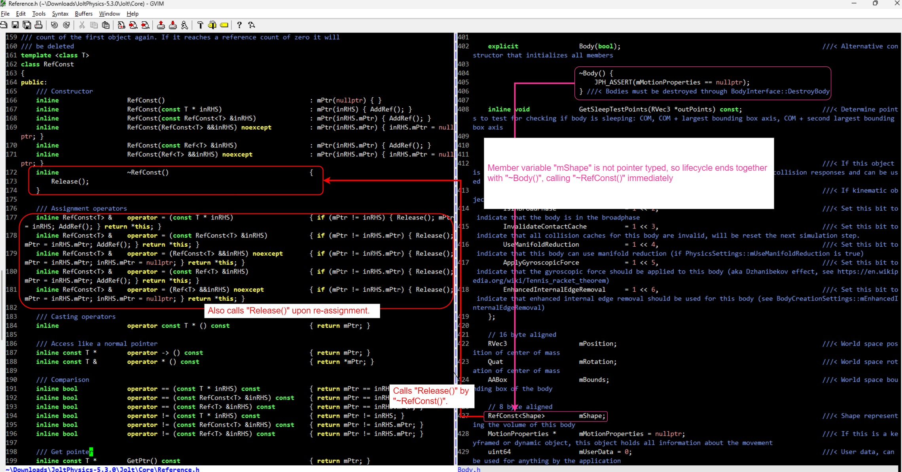

# Destructor trick

Body itself is NOT `RefTarget<T>`, then upon deletion of a Body how is `RefConst<Shape> Body.mShape` automatically calling "RefTarget.Release()"?
- The trick is *NOT* in macro `class Body { public: JPH_OVERRIDE_NEW_DELETE }`. See https://github.com/jrouwe/JoltPhysics/blob/v5.3.0/Jolt/Core/Memory.h#L33, https://github.com/jrouwe/JoltPhysics/blob/v5.3.0/Jolt/Core/Memory.cpp#L18 and https://github.com/jrouwe/JoltPhysics/blob/v5.3.0/Jolt/Core/Memory.cpp#L34, the default implementation `JPH::Free = FreeImpl` is just calling `pure-C free(void* inBlock)` which ISN'T recursive.
- The trick is simply that "Body.mShape" is *NOT* pointer typed, i.e. whose on-stack lifecycle ends together with `delete (Body* body)` and destructor `~RefConst()` IMPLICITLY called at the end of `~Body()`.

  

# Scope of cross-runtime passing

The second biggest problem: shall we allow C# side access "Ref\<T\>" or "RefConst\<T\>" objects? They're so difficult for serialization so I hope that can be avoided by a careful design.

- C# side must handle 
	- Local player input
	- TCP and UDP inputs from other players
	- R/W access to "RingBuffer<RenderFrame> rdfBuffer" 
	- R/W access to "RingBuffer<InputFrame> inputBuffer"

- C/C++ must handle 
	- R/W access to "RingBuffer<RenderFrame> rdfBuffer"
	- Read only access to "RingBuffer<InputFrame> inputBuffer"
