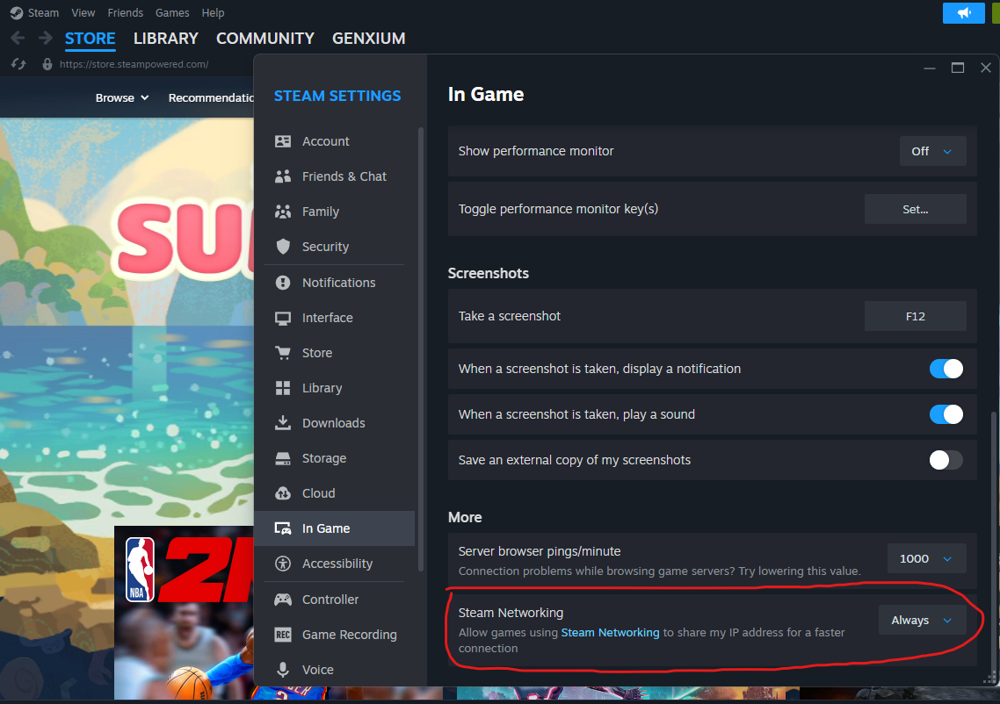

# Does this lib actually work?

Yes, there's a closed-source project dedicated for the account system, backend session management and frontend rendering, here're some screen-recordings of PvP battles over the internet (all having `ping` around 20ms~300ms during test).

- [recording#14, 2026-04](https://pan.baidu.com/s/1vR1vIsAY5IsrvRVv0n325A?pwd=529b), P1 Nanjing City v.s. P2 Dongguan City 

- [recording#13, 2026-04](https://pan.baidu.com/s/1jkE_Yje6gaDj8mnEwa16cg?pwd=9381), P1 Nanjing City v.s. P2 Dongguan City 

  

- [recording#12, 2026-04](https://pan.baidu.com/s/1NZFRMpcPVtbdvMZeBCXjTw?pwd=x75a), P1 Dongguan City v.s. P2 Nanjing City 

- [recording#11, 2026-04](https://pan.baidu.com/s/1tua_LuKCwMyK5idK9m0uvg?pwd=fuj5), P1 Nanjing City v.s. P2 Dongguan City 

- [recording#10, 2026-04](https://pan.baidu.com/s/1tD87UWjZeJYpYqgtuJCPew?pwd=r63u), P1 Nanjing City v.s. P2 Dongguan City 

- [recording#9, 2026-04](https://pan.baidu.com/s/1LanwXLryIv_GqJwjQMmy7Q?pwd=bt9h), P1 Dongguan City v.s. P2 Nanjing City 

- [recording#8, 2026-04](https://pan.baidu.com/s/1L20oPXCgo6PZd2qxZxCnOg?pwd=sf4u), P1 Dongguan City v.s. P2 Nanjing City 

  

- [recording#7, 2026-04](https://pan.baidu.com/s/12FXwRwI1CE9pM_0vFSAVyQ?pwd=ht2n), P1 Nanjing City v.s. P2 Dongguan City 

- [recording#6, 2026-04](https://pan.baidu.com/s/1CJt4sfWMszS0roR1Aqv2Hg?pwd=4xyu), same hardware setup as the previous recording

- [recording#5, 2026-03](https://pan.baidu.com/s/1wM5Xvq5wjFF7_7MC9ctJyg?pwd=fhyj), kindly note that **BladeGirl side was a laptop in low-battery state and connected to a Wi-Fi hotspot located 1 floor downstairs with a closed wooden door whilst the HunterGirl side was connected to both power and another Wi-Fi hotspot within 50cm on the same desk**

- [recording#4, 2026-03](https://pan.baidu.com/s/1qb3-06EjMM5SFtnLtWMigQ?pwd=6pbr)

- [recording#3, 2026-03](https://pan.baidu.com/s/1PkM0aexLQeE8188rIqQLag?pwd=tjrh)

- [recording#2, 2026-03](https://pan.baidu.com/s/1vUPCo_V-u_i8aeOfonSsfA?pwd=qmae)

- [recording#1, 2025-11](https://pan.baidu.com/s/1SdXJFFyo0_z0G8yhuavpKQ?pwd=43jb)

Afterall, the underlying netcode is the same as [DelayNoMoreUnity](https://github.com/genxium/DelayNoMoreUnity/tree/v2.3.4).

## Yet the devil is in the details 

At [an early commit](https://github.com/genxium/JoltDLLMU/commit/029c51f5fd8d5ddc56e297f4c1189e221217523b), I experienced bad synchronization around only 100ms ping, which was not the case in [DelayNoMoreUnity](https://github.com/genxium/DelayNoMoreUnity/tree/v2.3.4). After several rounds of variable-controlled measurements, it was concluded that a difference in "character airing time" is the root cause of performance degradation.     

Here's a timeline-aligned comparison of [that early commit (up)](https://github.com/genxium/JoltDLLMU/commit/029c51f5fd8d5ddc56e297f4c1189e221217523b) v.s [DelayNoMoreUnity (down)](https://github.com/genxium/DelayNoMoreUnity/tree/v2.3.4).
- Timeline is slowed down by a factor of 10, and [the original recording is here](https://pan.baidu.com/s/1M98g7hNSgjMh1hrOlbsMMw?pwd=wwrf).   
- The Jolt version is approximately 250ms shorter than the DelayNoMoreUnity version in the whole ascending+descending period, moreover it's 125+ms shorter only in the descending period.
- A reduction of 125+ms only in the descending period -- when a real player often uses skills -- makes it extremely prone to `peer input lag`, e.g. given `INPUT_SCALE_FRAMES=2` and `BATTLE_DYNAMICS_FPS=60` we lost 125ms ~ 7.50 render frames ~ 1.87 input frames of `peer input lag tolerance`. 

 

I saw lots of `peer character position dragged by interpolation` backthen even around only 100ms ping when `peer character` used `air dashing`.

Therefore good synchronization is not all about abstract algorithm design, a matching set of magic constants is also important. 

# Does this lib work for P2P only topology?

Yes, I have a "successful experience" using it with [Steam Lobby](https://partner.steamgames.com/doc/features/multiplayer/matchmaking) and [ISteamNetworkingMessages](https://partner.steamgames.com/doc/api/ISteamNetworkingMessages) via [Steamworks.NET](https://github.com/rlabrecque/Steamworks.NET/tree/master). 

By "successful experience" it means an internet competitive PvP experience very similar to the screen-recordings above (which in turn uses a dedicated-server like that of [DelayNoMoreUnity](https://github.com/genxium/DelayNoMoreUnity/tree/v2.3.4)), with a few tunings or constraints
- total count of players in a single battle is kept no more than 4 (a bigger count of players in a single battle for competitive PvP might NOT be a best use case for P2P, please be careful if you're interested in it) 
- find a way to break "lag-induced-freezing avalanche across all players" by the "Lobby owner", see `<proj-root>/SteamP2PCodeSnippets/SteamOnlineMapController.cs` for more information 

Essential code snippets from a closed-source project are put in `<proj-root>/SteamP2PCodeSnippets/` folder for your reference. 

Please make sure that you enabled `Steam Networking` in `Steam/Settings/In Game` as shown in the screenshot below (`Always` is not necessary for everyone, I'm just being lazy).

Here's a list of screen-recordings of Nanjing v.s. Dongguan PVP tests using Steam P2P. As I live in China, the famous "NetEase Virtual LAN room" has been tested just for fun -- performance-wise I don't think it contributes much to reduce delay or packet loss.
- [movement test only](https://pan.baidu.com/s/1EQ7EhSR_z0DhThD1ZsH_TA?pwd=5vcb)
- [NetEase UU accelerator Virtual LAN room test 1](https://pan.baidu.com/s/1i_OxM3j26p0ZfkcTd71pYg?pwd=yqrz)
- [NetEase UU accelerator Virtual LAN room test 2](https://pan.baidu.com/s/1EzK17xwUjiP0g97PkPrR0A?pwd=62qg)
- [a more realistic, competitive test](https://pan.baidu.com/s/1SCbX-Oj57WuyzYzUEz-Oww?pwd=gun8)

# Why NOT use a "static library `joltc`"?

The main target `joltc.dll` (or `libjoltc.so`) is used by `JoltCSharpBindings.cs` via `DllImport("joltc")` which doesn't support static library, so there's no need to support static library build in the cmake scripts.

# Why use a "static library `protobuf`" by default?

First of all, it's [recommended by the library itself](https://github.com/protocolbuffers/protobuf/tree/v31.1/cmake#dlls-vs-static-linking).

Besides the reasons given above, it's also important to build [Google Abseil](https://protobuf.dev/reference/cpp/abseil/) as "static libraries" for `Protobuf v22+` to avoid cascade-dynamic-linking. 

What if Google Abseil is built as "dynamic libraries" instead? In that case [all these dependencies](https://github.com/protocolbuffers/protobuf/blob/v31.1/cmake/abseil-cpp.cmake#L56) have to be copied for shipping on Linux -- moreover, there're internal cascade-dynamic-linking within Google Abseil itself too (e.g. `absl::cord` requires a few `libabsl_*_internal_*.so` files). That said, I did take the challenge and succeeded in building a shippable `libjoltc.so` by `<proj-root>/start_linux_dynamic_pb_docker_container_interactive.sh` (e.g. verified by a shipped C# backend service).
