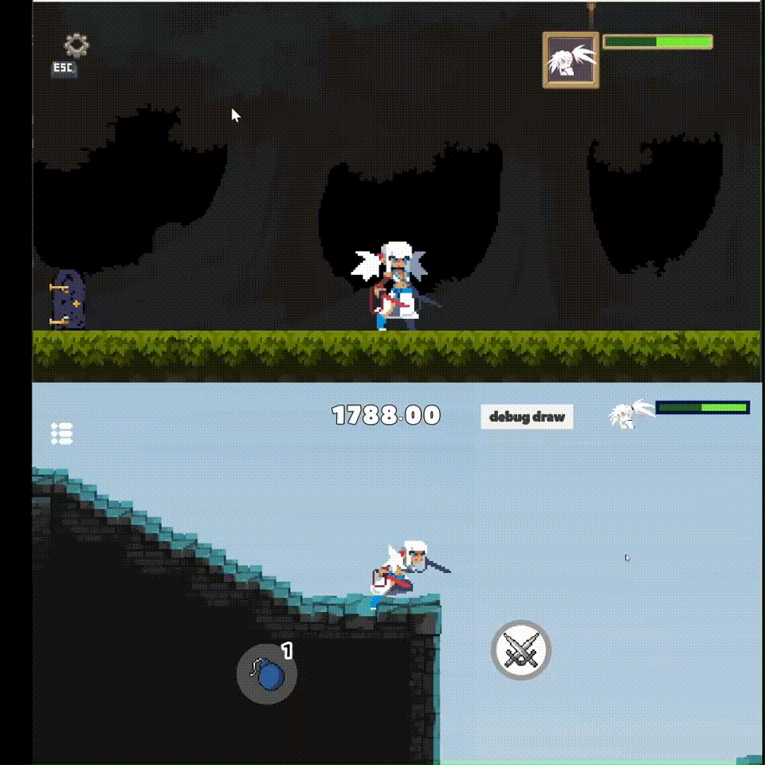

# Does this lib actually work?

Yes, there's a closed-source project dedicated for the account system, backend session management and frontend rendering, here're some screen-recordings of battles over the internet (all having `ping` around 20ms~300ms during test).
- [recording#7, 2026-04](https://pan.baidu.com/s/12FXwRwI1CE9pM_0vFSAVyQ?pwd=ht2n), P1 Nanjing City v.s. P2 Dongguan City 

  

- [recording#6, 2026-04](https://pan.baidu.com/s/1CJt4sfWMszS0roR1Aqv2Hg?pwd=4xyu), same hardware setup as the previous recording

  

- [recording#5, 2026-03](https://pan.baidu.com/s/1wM5Xvq5wjFF7_7MC9ctJyg?pwd=fhyj), kindly note that **BladeGirl side was a laptop in low-battery state and connected to a Wi-Fi hotspot located 1 floor downstairs with a closed wooden door whilst the HunterGirl side was connected to both power and another Wi-Fi hotspot within 50cm on the same desk**

- [recording#4, 2026-03](https://pan.baidu.com/s/1qb3-06EjMM5SFtnLtWMigQ?pwd=6pbr)

- [recording#3, 2026-03](https://pan.baidu.com/s/1PkM0aexLQeE8188rIqQLag?pwd=tjrh)

- [recording#2, 2026-03](https://pan.baidu.com/s/1vUPCo_V-u_i8aeOfonSsfA?pwd=qmae)

- [recording#1, 2025-11](https://pan.baidu.com/s/1SdXJFFyo0_z0G8yhuavpKQ?pwd=43jb)

Afterall, the underlying netcode is the same as [DelayNoMoreUnity](https://github.com/genxium/DelayNoMoreUnity/tree/v2.3.4).

## Yet the devil is in the details 

At [an early commit](https://github.com/genxium/JoltDLLMU/commit/029c51f5fd8d5ddc56e297f4c1189e221217523b), I experienced bad synchronization around only 100ms ping, which was not the case in [DelayNoMoreUnity](https://github.com/genxium/DelayNoMoreUnity/tree/v2.3.4). After several rounds of variable-controlled measurements, it was concluded that a difference in "character airing time" is the root cause of performance degradation.     

Here's a timeline-aligned comparison of [that early commit (up)](https://github.com/genxium/JoltDLLMU/commit/029c51f5fd8d5ddc56e297f4c1189e221217523b) v.s [DelayNoMoreUnity (down)](https://github.com/genxium/DelayNoMoreUnity/tree/v2.3.4).
- Timeline is slowed down by a factor of 10, and [the original recording is here](https://pan.baidu.com/s/1M98g7hNSgjMh1hrOlbsMMw?pwd=wwrf).   
- The Jolt version is approximately 250ms shorter than the DelayNoMoreUnity version in the whole ascending+descending period, moreover it's 125+ms shorter only in the descending period.
- A reduction of 125+ms only in the descending period -- when a real player often uses skills -- makes it extremely prone to `peer input lag`, e.g. given `INPUT_SCALE_FRAMES=2` and `BATTLE_DYNAMICS_FPS=60` we lost 125ms ~ 7.50 render frames ~ 1.87 input frames of `peer input lag tolerance`. 

 

I saw lots of `peer character position dragged by interpolation` backthen even around only 100ms ping when `peer character` used `air dashing`.

Therefore good synchronization is not all about abstract algorithm design, a matching set of magic constants is also important. 

# Why NOT use a "static library `joltc`"?

The main target `joltc.dll` (or `libjoltc.so`) is used by `JoltCSharpBindings.cs` via `DllImport("joltc")` which doesn't support static library, so there's no need to support static library build in the cmake scripts.

# Why use a "static library `protobuf`" by default?

First of all, it's [recommended by the library itself](https://github.com/protocolbuffers/protobuf/tree/v31.1/cmake#dlls-vs-static-linking).

Besides the reasons given above, it's also important to build [Google Abseil](https://protobuf.dev/reference/cpp/abseil/) as "static libraries" for `Protobuf v22+` to avoid cascade-dynamic-linking. 

What if Google Abseil is built as "dynamic libraries" instead? In that case [all these dependencies](https://github.com/protocolbuffers/protobuf/blob/v31.1/cmake/abseil-cpp.cmake#L56) have to be copied for shipping on Linux -- moreover, there're internal cascade-dynamic-linking within Google Abseil itself too (e.g. `absl::cord` requires a few `libabsl_*_internal_*.so` files). That said, I did take the challenge and succeeded in building a shippable `libjoltc.so` by `<proj-root>/start_linux_dynamic_pb_docker_container_interactive.sh` (e.g. verified by a shipped C# backend service).
